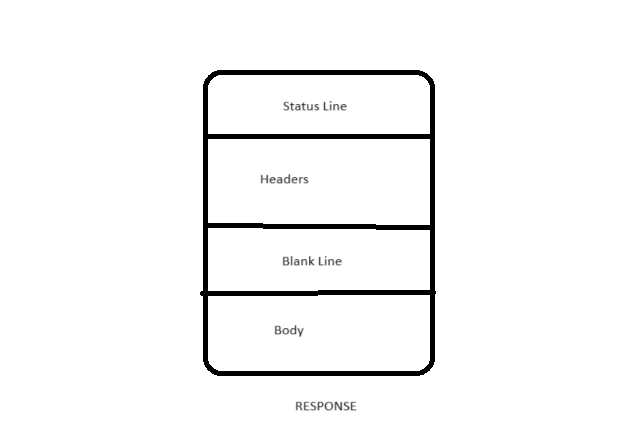
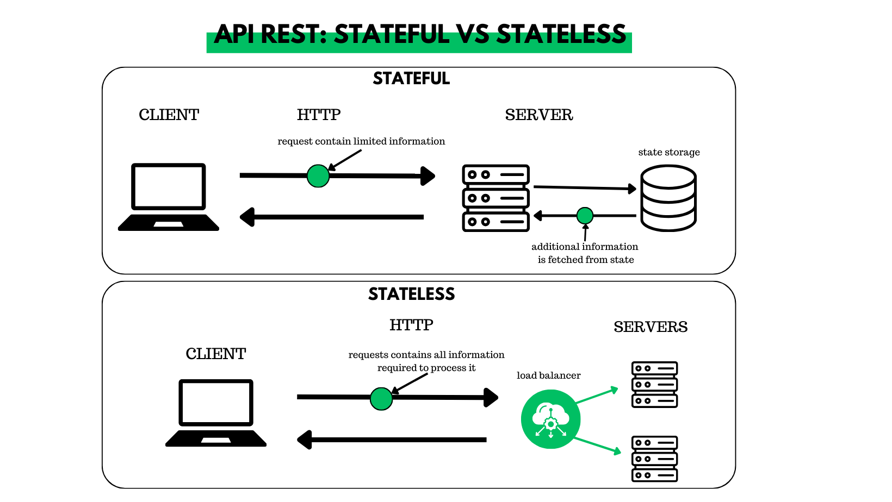

1. What are API’s? How are they used and why are they so popular?
   1. APIs are mechanisms that enable two software components to communicate with each other using a set of definitions and protocols
   2.  They allow different applications to communicate with each other in real-time, on the internet. APIs have made it possible for different applications of different origins to interact with each other.

2. What is a REST API? What makes an API RESTful? What are the REST guidelines?
   1. A RESTful API is an architectural style for an application program interface (API) that uses HTTP requests to access and use data. That data can be used to GET, PUT, POST and DELETE data types, which refers to the reading, updating, creating and deleting of operations concerning resources.
   2. REST stands for Representational State Transfer. This means that when a client requests a resource using a REST API, the server transfers back the current state of the resource in a standardized representation.
   3. Guidelines:
    - Uniform Interface (HATEOS) App state can’t have assumptions made about it.
      - Hypermedia as the Engine of Application State - After a response is made, the server lets the client know which requests it can make next. This data is known as hypermedia.
    - Client Server.
    - Stateless. Can’t assume any info or knowledge, no client context is stored on the server. If you have state you can’t scale.
    - Cacheable. Allows you to cache the response and not have to retrieve the full data, respond to requests much faster
   
3. What is HTTP? (what does it stand for and what is it used for? What is HTTPS?)
   1. The Hypertext Transfer Protocol (HTTP) is the foundation of the World Wide Web, and is used to load webpages using hypertext links. HTTP is an application layer protocol designed to transfer information between networked devices and runs on top of other layers of the network protocol stack.
   2. Hypertext transfer protocol secure (HTTPS) is the secure version of HTTP, which is the primary protocol used to send data between a web browser and a website.

4. Explain HTTP request structure using the diagrams provided, or your own.
   1. HTTP requests, and responses, share similar structure and are composed of:
      - A start-line describing the requests to be implemented, or its status of whether successful or a failure. This is always a single line.
      - An optional set of HTTP headers specifying the request, or describing the body included in the message.
      - A blank line indicating all meta-information for the request has been sent.
      - An optional body containing data associated with the request (like content of an HTML form), or the document associated with a response. The presence of the body and its size is specified by the start-line and HTTP headers.

5. Explain HTTP response structure using the diagram provided, or your own.
   1. An HTTP response contains: A status line. A series of HTTP headers, or header fields. A message body, which is usually needed.

6. What are the 5 HTTP verbs and what do they do?
   1. HTTP verbs: 
      - Retrieve a single item or list of items (GET)
      - Create an item (POST)
      - Partial modifications to an item (PATCH)
      - Update an item (PUT)
      - Delete an item (DELETE)

7. What is statelessness? Show examples of “stateless” and “stateful” http requests.
   1. State is either maintained on the servers (stateful architecture) or in a separate database outside the servers (stateless architecture). The HTTP protocol itself does not maintain state.

8. What is caching?
   1. Caching is the process of storing copies of files in a cache, or temporary storage location, so that they can be accessed more quickly. Technically, a cache is any temporary storage location for copies of files or data