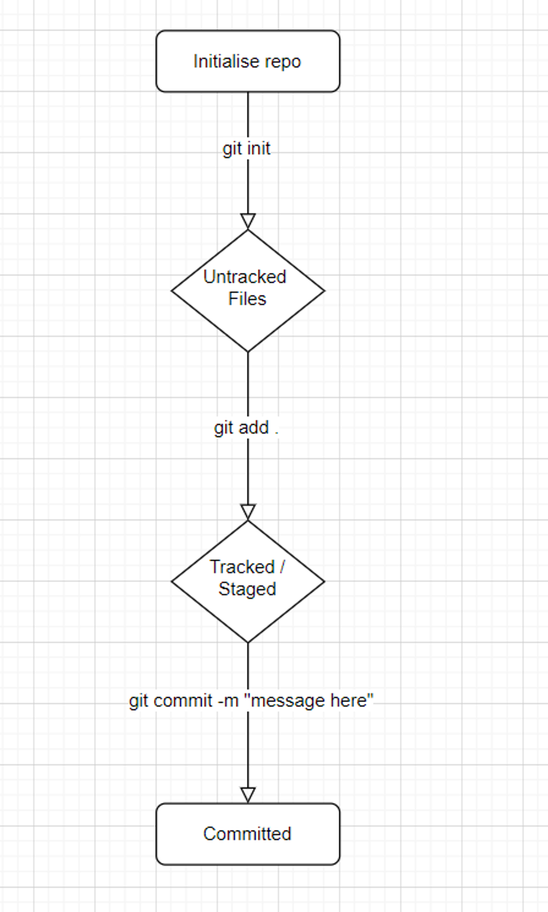

## Git

- Version Control:
    - Working on a document, got  a new version and don’t want to lose first one so save as new, can end up with loads of drafts
    - git is the industry standard of version control. It’s distributed: local copies on everyone’s machine that are independent until pushed back up.
    - Folder with document in:
        1. git init to make it a repo (repo adds tracking to the folder .git) -initialise
        2. git add: I want to stage these changes - putting changes into cardboard box
        3. git commit: added all changes need and add a label to it. git commit -m to add a message, always do this. Committing to this part being done - take a git snapshot
        4. commit often to keep track of work
    - Create a specific git folder
    - Don’t nest repos
    - Try to keep an organised easy to navigate file system
- GitHub:
    - Dropbox for GitHub
    - clone down a project from git
    - git push to push it to GitHub
    - git pull to get latest changes from GitHub