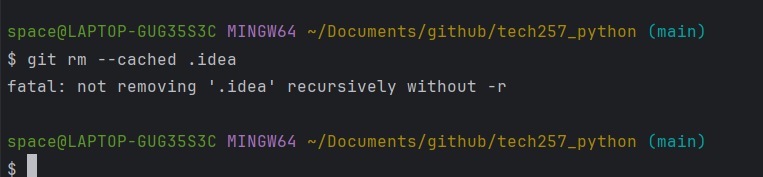
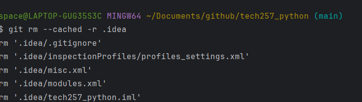

## GitHub

- Method one
    1. Create empty repo
    2. Configure or local repo to know where to sync to
    3. Push changes

OR

- Method two (can be quicker if you haven’t started coding)
    1. Create empty repo
    2. Run git clone command with repo address
    3. Copy all files / folders to empty repo
    4. Push changes

- GitHub push repo:
`git remote add origin <your repo link here>`
`git branch -M main`
    - Only do step 2 if your branch isn’t already called main
`git push -u origin main`

- Failed because it's a folder - recursive means to go further than just the folder but to go into everything within the folder

- The correct one to remove the folder

- Never have credentials in a git repo if you do, delete the repo
    - .gitignore is a safety net but don’t rely on it.